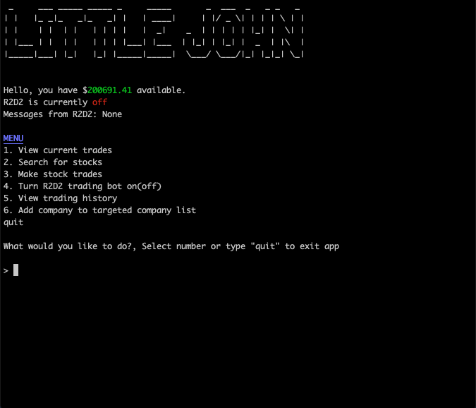
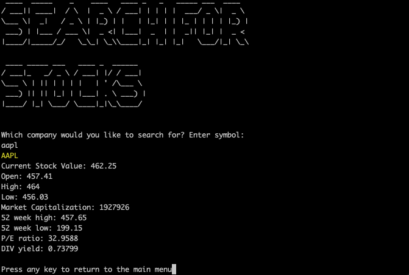
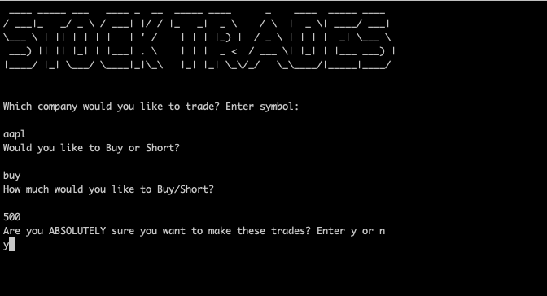
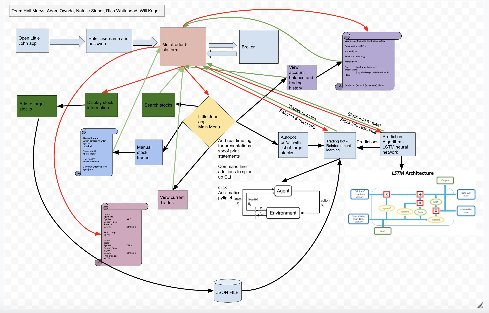

# Team Hail Marys

## Project Little John

---

### We presented in terminal on 8/20/2020!

[https://github.com/hail-marys/little-john]

---

## Web Application

As a group we created an AI stock market trading bot using python. Customers will be able to log into their account to view current trades and balances through the terminal along with past trading history. Customers will also be able to search for a companies stock price and history by searching either the companies name or symbol. Customers will be able to turn the auto trading bot on and off. 

---

## Tools Used
VS Code

- Python
- Finnhub
- Pyfiglet
- Termcolor
- Jupiter Notebook
- Pytest

---

## Recent Updates

#### V 1.0
*MVP* - 19 Aug 2020

---

## Getting Started

Clone this repository to your local machine.

```
$ git clone https://github.com/hail-marys/little-john
```
Once downloaded, cd into little_john. Activate your virtual environment by running poetry init then poetry shell

The poetry tools will automatically install any dependencies. Before running the application, an API key will be needed from finnhub.io

Once everything is installed run application in terminal: python little_john/main.py

Unit testing is included in the test file using the pytest test framework. 

---

## Usage
***Below are screen shot images of how our app Little John works***

### Main Menu


### Searching for Stocks


### Trading Stocks


---

## Data Flow 
***[Add a clean and clear explanation of what the data flow is. Walk me through it.]***


---

## Change Log
***[The change log will list any changes made to the code base. This includes any changes from TA/Instructor feedback]***
1.4: *Added OAuth for MySpace* - 23 Jan 2003
1.3: *Changed email handler to Alta Vista, fixed issue with styling on Netscape Navigator browser.* - 21 Dec 1999
1.2: *Fixed bug where pages would not load due to temp data* - 16 Jun 1998
1.1: *Added ability for user to change photos on a post* - 12 May 1998

---

## Authors
Adam Owada 
Natalie Sinner
Richard Whitehead
Will Koger

---

For more information on Markdown: https://www.markdownguide.org/cheat-sheet
