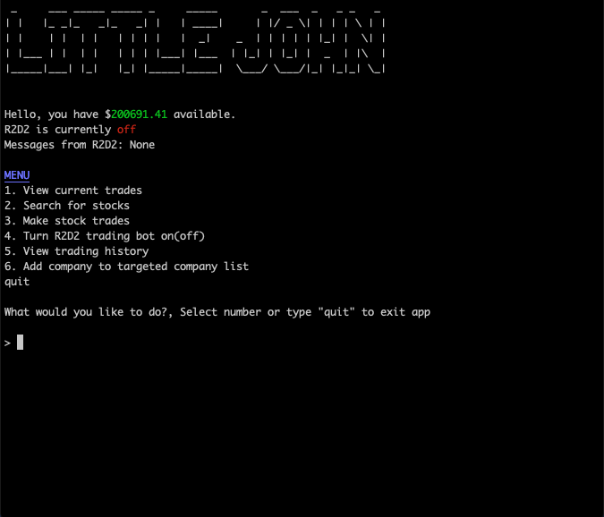
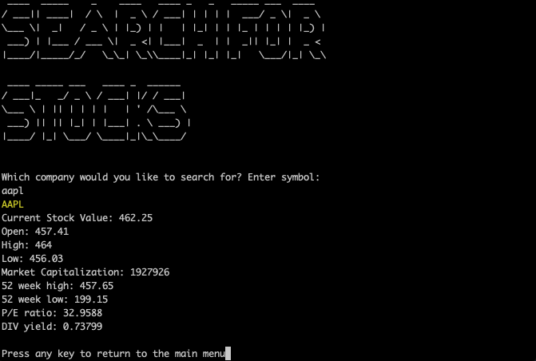
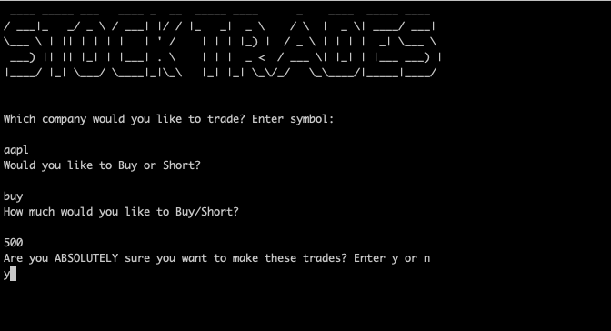
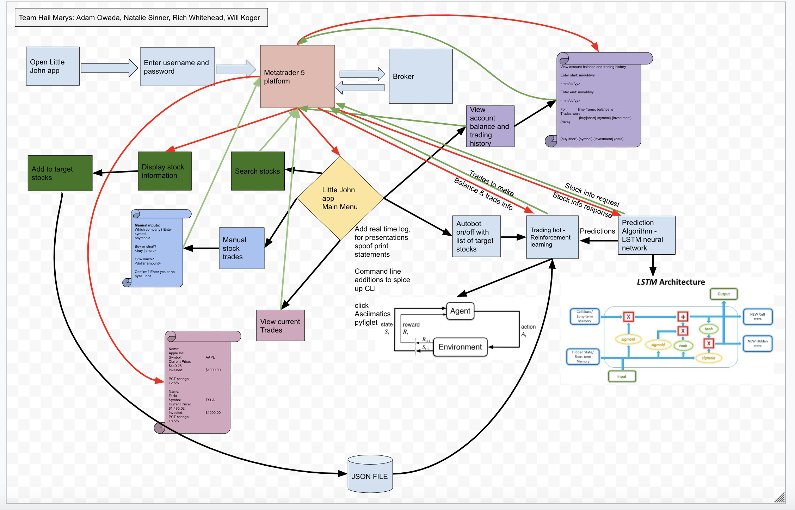

# Team Hail Marys

## Project Little John

---

### We presented in terminal on 8/20/2020!

[https://github.com/hail-marys/little-john]

---

## Web Application

As a group we created an AI stock market trading bot using python. Customers will be able to log into their account to view current trades and balances through the terminal along with past trading history. Customers will also be able to search for a companies stock price and history by searching either the companies name or symbol. Customers will be able to turn the auto trading bot on and off. 

---

## Tools Used
VS Code

- Python
- Finnhub
- Pyfiglet
- Termcolor
- Jupiter Notebook
- Pytest

---

## Recent Updates

#### V 1.0
*MVP* - 19 Aug 2020

---

## Getting Started

Clone this repository to your local machine.

```
$ git clone https://github.com/hail-marys/little-john
```
Once downloaded, cd into little_john. Activate your virtual environment by running poetry init then poetry shell

The poetry tools will automatically install any dependencies. Before running the application, an API key will be needed from finnhub.io

Once everything is installed run application in terminal: python little_john/main.py

Unit testing is included in the test file using the pytest test framework. 

---

## Usage
***Below are screen shot images of how our app Little John works***

### Main Menu


### Searching for Stocks


### Trading Stocks


---

## Data Flow 


---

## Change Log
- 1.5: *Fixed minor bugs, finished application* - 19 Aug 2020
- 1.4: *Connected prediction algorithm to trading bot* - 18 Aug 2020
- 1.3: *Started AI bot algorithm and set up* - 13 Aug 2020
- 1.2: *Added main menu, all related .py files, and JSON files* - 13 Aug 2020
- 1.1: *Had to pivot from MetaTrader 5 to Finnhub API* - 08 Aug 2020
- 1.0: *Finished all pre-work for project* - 06 Aug 2020

---

## Authors
Adam Owada 
Natalie Sinner
Richard Whitehead
Will Koger

---

For more information on Markdown: https://www.markdownguide.org/cheat-sheet
